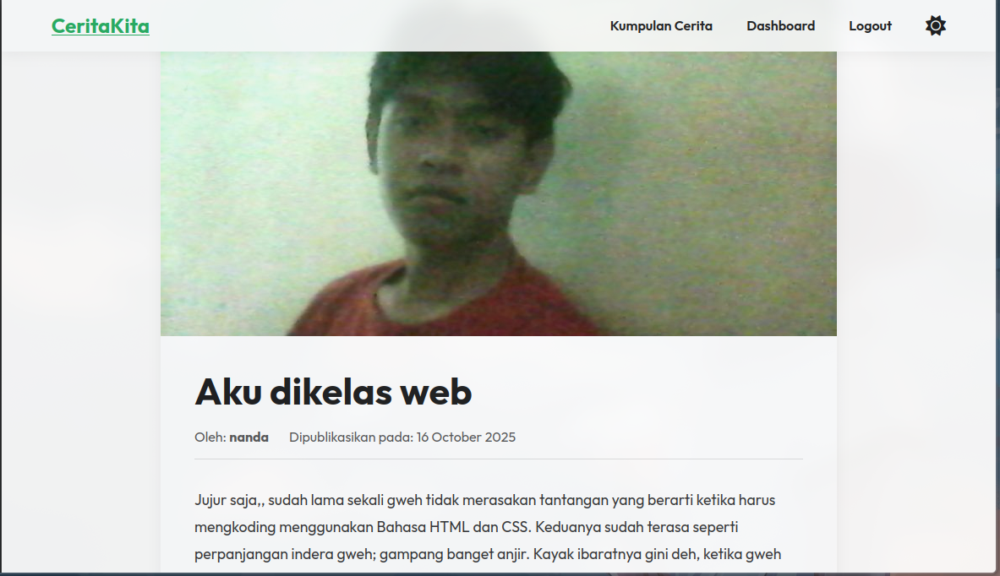

# 📚 CeritaKita

> Platform aplikasi web sederhana untuk berbagi dan membaca cerita

**CeritaKita** adalah platform berbasis web yang memungkinkan pengguna untuk berbagi dan membaca cerita. Dibangun menggunakan PHP native dan MySQL dengan fokus pada operasi CRUD dan autentikasi pengguna yang aman.



---

## ✨ Fitur Utama

### 🔐 Autentikasi Pengguna
- ✅ Registrasi pengguna baru (minimal 6 karakter password)
- ✅ Login & Logout yang aman
- ✅ Proteksi halaman otomatis (redirect ke login jika belum terautentikasi)

### 📝 Manajemen Cerita (CRUD)

#### Create (Tambah)
Pengguna dapat mempublikasikan cerita baru lengkap dengan:
- Judul cerita
- Nama penulis
- Isi cerita
- Upload gambar sampul

#### Read (Baca)
- 📖 Daftar semua cerita dengan *lazy loading* / *pagination*
- 📄 Detail cerita di halaman terpisah
- 🆕 Menampilkan 2 cerita terbaru di halaman beranda

#### Update (Edit)
- ✏️ Edit cerita yang Anda miliki melalui dashboard

#### Delete (Hapus)
- 🗑️ Hapus cerita dengan konfirmasi modal

### 🎛️ Dashboard Pengguna
- Kelola semua cerita yang telah Anda tulis
- Akses cepat untuk menambah, mengedit, atau menghapus cerita

### 🎨 Fitur Tambahan

| Fitur | Deskripsi |
|-------|-----------|
| 🔍 **Pencarian** | Cari cerita berdasarkan judul atau penulis |
| 📄 **Pagination** | Navigasi halaman untuk menelusuri banyak cerita |
| 🖼️ **Upload Gambar** | Validasi client & server-side, auto-reprocess untuk keamanan |
| 🌙 **Dark Mode** | Toggle tema terang/gelap |
| 💬 **Notifikasi Modal** | Flash message dalam bentuk pop-up yang elegan |
| ⚠️ **Konfirmasi Modal** | Konfirmasi sebelum menghapus cerita |

---

## 💻 Kebutuhan Sistem

### Server
- Apache / Nginx

### PHP
- **Versi**: 7.4 atau lebih baru (disarankan 8.x)
- **Ekstensi yang diperlukan**:
  - `mysqli` - Koneksi database
  - `gd` - Pemrosesan gambar
  - `fileinfo` - Validasi MIME type

### Database
- MySQL 5.7+ / MariaDB

### Browser
- Browser modern (Chrome, Firefox, Safari, Edge)

---

## 🗄️ Struktur Database

> ⚠️ **Penting**: Database SQL tidak disertakan di repositori. Anda perlu membuat tabel secara manual.

### Tabel `users`

```sql
CREATE TABLE users (
    id INT PRIMARY KEY AUTO_INCREMENT,
    username VARCHAR(50) UNIQUE NOT NULL,
    password VARCHAR(255) NOT NULL
);
```

### Tabel `cerita`

```sql
CREATE TABLE cerita (
    id INT PRIMARY KEY AUTO_INCREMENT,
    user_id INT NOT NULL,
    judul VARCHAR(255) NOT NULL,
    penulis VARCHAR(100) NOT NULL,
    isi TEXT NOT NULL,
    gambar VARCHAR(255),
    tanggal_dibuat TIMESTAMP DEFAULT CURRENT_TIMESTAMP,
    FOREIGN KEY (user_id) REFERENCES users(id) ON DELETE CASCADE
);
```

---

## 🚀 Instalasi

### Metode 1: Docker (Rekomendasi) 🐳

#### Langkah 1: Install Docker Desktop

1. Unduh [Docker Desktop](https://www.docker.com/products/docker-desktop/)
2. Install dan restart komputer jika diperlukan
3. Verifikasi instalasi:

```bash
docker --version
docker-compose --version
```

#### Langkah 2: Setup Proyek

##### Opsi A: Instalasi Manual Step-by-Step

1. **Clone repository dan buat struktur folder Docker:**

```bash
# Clone repository
git clone https://github.com/ridhosetia/ceritakita-web.git
cd ceritakita-web

# Buat folder public untuk file proyek
mkdir -p public

# Pindahkan semua file PHP dan folder proyek ke dalam folder public
# PENTING: Semua file aplikasi (*.php, css/, img/, dll) harus ada di folder public/
mv *.php public/ 2>/dev/null || true
mv css img layouts partials views uploads public/ 2>/dev/null || true
mv app.js public/ 2>/dev/null || true

# Struktur akhir akan seperti ini:
# ceritakita-web/
# ├── public/              ← Semua file aplikasi di sini
# │   ├── css/
# │   ├── img/
# │   ├── layouts/
# │   ├── partials/
# │   ├── uploads/
# │   ├── views/
# │   ├── *.php
# │   └── app.js
# ├── Dockerfile
# ├── uploads.ini
# └── docker-compose.yml
```

2. **Buat file Dockerfile:**

```bash
cat > Dockerfile << 'EOF'
# Base image PHP 8.3 dengan Apache
FROM php:8.3-apache

# Copy konfigurasi PHP kustom
COPY uploads.ini /usr/local/etc/php/conf.d/custom-uploads.ini

# Install ekstensi database
RUN docker-php-ext-install mysqli pdo_mysql

# Install dependensi untuk GD
RUN apt-get update && apt-get install -y \
    libfreetype6-dev \
    libjpeg62-turbo-dev \
    libpng-dev \
    libwebp-dev \
    libxpm-dev \
    zlib1g-dev \
    && rm -rf /var/lib/apt/lists/*

# Konfigurasi dan install GD
RUN docker-php-ext-configure gd --with-freetype --with-jpeg --with-webp \
    && docker-php-ext-install -j$(nproc) gd

# Enable Apache rewrite module
RUN a2enmod rewrite

# Set working directory ke /var/www/html
WORKDIR /var/www/html
EOF
```

3. **Buat file uploads.ini:**

```bash
cat > uploads.ini << 'EOF'
; Konfigurasi upload dan memori PHP

memory_limit = 256M
upload_max_filesize = 20M
post_max_size = 25M
EOF
```

4. **Buat file docker-compose.yml:**

```bash
cat > docker-compose.yml << 'EOF'
version: '3.8'

services:
  web:
    build: .
    container_name: ceritakita_web
    ports:
      - "8000:80"
    volumes:
      - ./public:/var/www/html
    depends_on:
      - mysql
    restart: unless-stopped

  mysql:
    image: mysql:8.0
    container_name: ceritakita_db
    restart: unless-stopped
    ports:
      - "3306:3306"
    environment:
      MYSQL_DATABASE: ceritakita_db
      MYSQL_USER: user_ceritakita
      MYSQL_PASSWORD: password_rahasia
      MYSQL_ROOT_PASSWORD: root_password_rahasia
    volumes:
      - mysql_data:/var/lib/mysql

volumes:
  mysql_data:
EOF
```

5. **Buat/Edit file koneksi.php di folder public:**

```bash
cat > public/koneksi.php << 'EOF'
<?php
$db_host = 'mysql';                  // Nama service di docker-compose
$db_user = 'user_ceritakita';        // Sesuai MYSQL_USER
$db_pass = 'password_rahasia';       // Sesuai MYSQL_PASSWORD
$db_name = 'ceritakita_db';          // Sesuai MYSQL_DATABASE

$conn = new mysqli($db_host, $db_user, $db_pass, $db_name);

if ($conn->connect_error) {
    die("Koneksi gagal: " . $conn->connect_error);
}

$conn->set_charset("utf8mb4");
?>
EOF
```

6. **Build dan jalankan container:**

```bash
# Build image dan start containers
docker-compose up -d --build

# Cek status container
docker-compose ps

# Lihat logs jika ada masalah
docker-compose logs -f web
```

---

##### Opsi B: Instalasi Otomatis dengan Script 🚀

Gunakan script bash berikut untuk setup otomatis:

```bash
# Download dan jalankan script setup
curl -fsSL https://raw.githubusercontent.com/ridhosetia/ceritakita-web/main/docker-setup.sh | bash
```

**Atau buat script manual:**

```bash
# Buat file setup script
cat > docker-setup.sh << 'SCRIPT'
#!/bin/bash

echo "🚀 CeritaKita Docker Setup Script"
echo "=================================="
echo ""

# Warna untuk output
RED='\033[0;31m'
GREEN='\033[0;32m'
YELLOW='\033[1;33m'
NC='\033[0m' # No Color

# Cek apakah Docker terinstall
if ! command -v docker &> /dev/null; then
    echo -e "${RED}❌ Docker tidak ditemukan. Silakan install Docker Desktop terlebih dahulu.${NC}"
    exit 1
fi

if ! command -v docker-compose &> /dev/null; then
    echo -e "${RED}❌ Docker Compose tidak ditemukan. Silakan install Docker Desktop terlebih dahulu.${NC}"
    exit 1
fi

echo -e "${GREEN}✅ Docker terdeteksi${NC}"
echo ""

# Clone repository
echo "📦 Cloning repository..."
if [ -d "ceritakita-web" ]; then
    echo -e "${YELLOW}⚠️  Folder ceritakita-web sudah ada. Menggunakan folder yang ada.${NC}"
    cd ceritakita-web
else
    git clone https://github.com/ridhosetia/ceritakita-web.git
    cd ceritakita-web
fi
echo ""

# Buat folder public
echo "📁 Membuat struktur folder..."
mkdir -p public

# Pindahkan file ke public
echo "📋 Memindahkan file aplikasi ke folder public..."
find . -maxdepth 1 -type f -name "*.php" -exec mv {} public/ \; 2>/dev/null
[ -d "css" ] && mv css public/ 2>/dev/null
[ -d "img" ] && mv img public/ 2>/dev/null
[ -d "layouts" ] && mv layouts public/ 2>/dev/null
[ -d "partials" ] && mv partials public/ 2>/dev/null
[ -d "views" ] && mv views public/ 2>/dev/null
[ -d "uploads" ] && mv uploads public/ 2>/dev/null
[ -f "app.js" ] && mv app.js public/ 2>/dev/null
echo ""

# Buat Dockerfile
echo "🐳 Membuat Dockerfile..."
cat > Dockerfile << 'EOF'
FROM php:8.3-apache
COPY uploads.ini /usr/local/etc/php/conf.d/custom-uploads.ini
RUN docker-php-ext-install mysqli pdo_mysql
RUN apt-get update && apt-get install -y \
    libfreetype6-dev \
    libjpeg62-turbo-dev \
    libpng-dev \
    libwebp-dev \
    libxpm-dev \
    zlib1g-dev \
    && rm -rf /var/lib/apt/lists/*
RUN docker-php-ext-configure gd --with-freetype --with-jpeg --with-webp \
    && docker-php-ext-install -j$(nproc) gd
RUN a2enmod rewrite
WORKDIR /var/www/html
EOF
echo ""

# Buat uploads.ini
echo "⚙️  Membuat konfigurasi PHP..."
cat > uploads.ini << 'EOF'
memory_limit = 256M
upload_max_filesize = 20M
post_max_size = 25M
EOF
echo ""

# Buat docker-compose.yml
echo "🐋 Membuat docker-compose.yml..."
cat > docker-compose.yml << 'EOF'
version: '3.8'

services:
  web:
    build: .
    container_name: ceritakita_web
    ports:
      - "8000:80"
    volumes:
      - ./public:/var/www/html
    depends_on:
      - mysql
    restart: unless-stopped

  mysql:
    image: mysql:8.0
    container_name: ceritakita_db
    restart: unless-stopped
    ports:
      - "3306:3306"
    environment:
      MYSQL_DATABASE: ceritakita_db
      MYSQL_USER: user_ceritakita
      MYSQL_PASSWORD: password_rahasia
      MYSQL_ROOT_PASSWORD: root_password_rahasia
    volumes:
      - mysql_data:/var/lib/mysql

volumes:
  mysql_data:
EOF
echo ""

# Buat koneksi.php
echo "🔌 Membuat file koneksi database..."
cat > public/koneksi.php << 'EOF'
<?php
$db_host = 'mysql';
$db_user = 'user_ceritakita';
$db_pass = 'password_rahasia';
$db_name = 'ceritakita_db';

$conn = new mysqli($db_host, $db_user, $db_pass, $db_name);

if ($conn->connect_error) {
    die("Koneksi gagal: " . $conn->connect_error);
}

$conn->set_charset("utf8mb4");
?>
EOF
echo ""

# Build dan jalankan
echo "🔨 Building Docker image (ini mungkin memakan waktu beberapa menit)..."
docker-compose up -d --build

if [ $? -eq 0 ]; then
    echo ""
    echo -e "${GREEN}✅ Setup berhasil!${NC}"
    echo ""
    echo "📊 Status Container:"
    docker-compose ps
    echo ""
    echo -e "${GREEN}🎉 Aplikasi siap digunakan!${NC}"
    echo ""
    echo "📝 Langkah selanjutnya:"
    echo "1. Buka database client (DBeaver, HeidiSQL, dll)"
    echo "2. Koneksi ke: localhost:3306"
    echo "3. Username: user_ceritakita"
    echo "4. Password: password_rahasia"
    echo "5. Buat tabel 'users' dan 'cerita'"
    echo ""
    echo -e "${GREEN}🌐 Akses aplikasi: http://localhost:8000${NC}"
    echo ""
    echo "📋 Perintah berguna:"
    echo "  docker-compose logs -f web    # Lihat logs"
    echo "  docker-compose down           # Stop containers"
    echo "  docker-compose restart        # Restart containers"
else
    echo -e "${RED}❌ Setup gagal. Silakan cek error di atas.${NC}"
    exit 1
fi
SCRIPT

# Beri permission executable
chmod +x docker-setup.sh

# Jalankan script
./docker-setup.sh
```

---

#### Langkah 3: Setup Database

Setelah container berjalan, setup database dengan salah satu cara berikut:

##### Cara 1: Menggunakan Database Client (Rekomendasi)

```bash
# Gunakan database client favorit Anda (DBeaver, HeidiSQL, DataGrip, dll)
# Konfigurasi koneksi:
# Host: localhost
# Port: 3306
# Username: user_ceritakita
# Password: password_rahasia
# Database: ceritakita_db
```

##### Cara 2: Menggunakan Command Line

```bash
# Masuk ke MySQL shell
docker exec -it ceritakita_db mysql -u user_ceritakita -p
# Masukkan password: password_rahasia

# Atau langsung dengan password dalam command (tidak aman untuk production)
docker exec -it ceritakita_db mysql -u user_ceritakita -ppassword_rahasia ceritakita_db

# Kemudian jalankan query SQL:
# CREATE TABLE users (...);
# CREATE TABLE cerita (...);
```

##### Cara 3: Import dari File SQL

```bash
# Jika Anda punya file SQL (misal: database.sql)
docker exec -i ceritakita_db mysql -u user_ceritakita -ppassword_rahasia ceritakita_db < database.sql
```

##### Cara 4: Membuat Script SQL Otomatis

```bash
# Buat file init-db.sql
cat > init-db.sql << 'EOF'
CREATE TABLE IF NOT EXISTS users (
    id INT PRIMARY KEY AUTO_INCREMENT,
    username VARCHAR(50) UNIQUE NOT NULL,
    password VARCHAR(255) NOT NULL
);

CREATE TABLE IF NOT EXISTS cerita (
    id INT PRIMARY KEY AUTO_INCREMENT,
    user_id INT NOT NULL,
    judul VARCHAR(255) NOT NULL,
    penulis VARCHAR(100) NOT NULL,
    isi TEXT NOT NULL,
    gambar VARCHAR(255),
    tanggal_dibuat TIMESTAMP DEFAULT CURRENT_TIMESTAMP,
    FOREIGN KEY (user_id) REFERENCES users(id) ON DELETE CASCADE
);
EOF

# Import ke database
docker exec -i ceritakita_db mysql -u user_ceritakita -ppassword_rahasia ceritakita_db < init-db.sql

echo "✅ Database tables created successfully!"
```

---

#### Langkah 4: Akses Aplikasi

```bash
# Cek apakah container berjalan
docker-compose ps

# Lihat logs jika ada masalah
docker-compose logs -f web

# Akses aplikasi di browser
# 🌐 http://localhost:8000
```

---

### 📋 Perintah Docker Berguna

```bash
# ===== MANAJEMEN CONTAINER =====

# Start containers
docker-compose up -d

# Stop containers
docker-compose down

# Restart containers
docker-compose restart

# Stop dan hapus semua data (HATI-HATI!)
docker-compose down -v

# ===== MONITORING =====

# Lihat status container
docker-compose ps

# Lihat logs real-time
docker-compose logs -f

# Lihat logs web service saja
docker-compose logs -f web

# Lihat logs database saja
docker-compose logs -f mysql

# ===== DEBUGGING =====

# Masuk ke container web (PHP/Apache)
docker exec -it ceritakita_web bash

# Masuk ke MySQL shell
docker exec -it ceritakita_db mysql -u user_ceritakita -ppassword_rahasia

# Cek PHP info
docker exec ceritakita_web php -i

# Cek ekstensi PHP yang terinstall
docker exec ceritakita_web php -m

# ===== MAINTENANCE =====

# Rebuild image (setelah ubah Dockerfile)
docker-compose build

# Rebuild dan restart
docker-compose up -d --build

# Hapus unused images dan containers
docker system prune -a

# Backup database
docker exec ceritakita_db mysqldump -u user_ceritakita -ppassword_rahasia ceritakita_db > backup.sql

# Restore database
docker exec -i ceritakita_db mysql -u user_ceritakita -ppassword_rahasia ceritakita_db < backup.sql

# ===== TROUBLESHOOTING =====

# Jika port 8000 sudah digunakan, ubah di docker-compose.yml:
# ports:
#   - "8080:80"  # Ganti 8000 menjadi 8080

# Jika MySQL port conflict, ubah:
# ports:
#   - "3307:3306"  # Ganti 3306 menjadi 3307
```

---

### Metode 2: XAMPP 🔴

1. **Clone ke folder htdocs**
   ```bash
   cd C:\xampp\htdocs
   git clone https://github.com/ridhosetia/ceritakita-web.git
   ```

2. **Jalankan XAMPP**
   - Start Apache dan MySQL dari Control Panel

3. **Buat Database**
   - Buka `http://localhost/phpmyadmin`
   - Buat database `ceritakita_db`
   - Buat tabel `users` dan `cerita`

4. **Konfigurasi koneksi.php**
   ```php
   <?php
   $db_host = 'localhost';
   $db_user = 'root';
   $db_pass = '';              // Default XAMPP kosong
   $db_name = 'ceritakita_db';
   
   $conn = new mysqli($db_host, $db_user, $db_pass, $db_name);
   $conn->set_charset("utf8mb4");
   ?>
   ```

5. **Akses Aplikasi**
   - 🌐 `http://localhost/ceritakita-web`

---

### Metode 3: Laragon 🔷

1. **Clone ke folder www**
   ```bash
   cd C:\laragon\www
   git clone https://github.com/ridhosetia/ceritakita-web.git
   ```

2. **Jalankan Laragon**
   - Klik "Start All"

3. **Buat Database**
   - Klik tombol "Database" di Laragon
   - Buat database `ceritakita_db`
   - Buat tabel `users` dan `cerita`

4. **Konfigurasi koneksi.php**
   ```php
   <?php
   $db_host = 'localhost';
   $db_user = 'root';
   $db_pass = '';              // Default Laragon kosong
   $db_name = 'ceritakita_db';
   
   $conn = new mysqli($db_host, $db_user, $db_pass, $db_name);
   $conn->set_charset("utf8mb4");
   ?>
   ```

5. **Akses Aplikasi**
   - 🌐 `http://ceritakita-web.test` (virtual host)
   - atau `http://localhost/ceritakita-web`

---

## 📁 Struktur Folder

### Struktur dengan Docker:

```
ceritakita-web/
│
├── 📂 public/                    ← SEMUA FILE APLIKASI DI SINI
│   ├── 📂 css/
│   │   ├── cerita.css
│   │   ├── dashboard.css
│   │   ├── login.css
│   │   └── style.css
│   │
│   ├── 📂 img/
│   │   └── placeholder.png
│   │
│   ├── 📂 layouts/
│   │   └── app.php
│   │
│   ├── 📂 partials/
│   │   ├── _footer.php
│   │   ├── _header.php
│   │   └── _nav.php
│   │
│   ├── 📂 uploads/              ← Upload pengguna
│   │   ├── img_xxx.png
│   │   └── ...
│   │
│   ├── 📂 views/
│   │   ├── cerita.php
│   │   ├── dashboard.php
│   │   ├── detail_cerita.php
│   │   ├── edit_cerita.php
│   │   ├── home.php
│   │   ├── login.php
│   │   ├── register.php
│   │   └── tambah_cerita.php
│   │
│   ├── 📄 app.js
│   ├── 📄 cerita.php
│   ├── 📄 dashboard.php
│   ├── 📄 detail_cerita.php
│   ├── 📄 edit_cerita.php
│   ├── 📄 hapus_cerita.php
│   ├── 📄 helpers.php
│   ├── 📄 index.php
│   ├── 📄 koneksi.php
│   ├── 📄 login.php
│   ├── 📄 logout.php
│   ├── 📄 register.php
│   └── 📄 tambah_cerita.php
│
├── 📄 Dockerfile                 ← Konfigurasi Docker Image
├── 📄 uploads.ini                ← Konfigurasi PHP
├── 📄 docker-compose.yml         ← Orchestration Docker
├── 📄 init-db.sql               ← (Opsional) Script init database
└── 📄 README.md
```

### Struktur tanpa Docker (XAMPP/Laragon):

```
ceritakita-web/
│
├── 📂 css/
├── 📂 img/
├── 📂 layouts/
├── 📂 partials/
├── 📂 uploads/
├── 📂 views/
├── 📄 *.php
└── 📄 README.md
```

---

## 🔧 Konfigurasi Database

Aplikasi ini tidak menggunakan file `.env`. Konfigurasi koneksi database diatur langsung di `koneksi.php`.

### Contoh Template

```php
<?php
// ============================================
// KONFIGURASI DATABASE
// ============================================

$db_host = 'localhost';        // Host database
$db_user = 'root';             // Username database
$db_pass = '';                 // Password database (kosongkan jika tidak ada)
$db_name = 'ceritakita_db';    // Nama database

// ============================================
// KONEKSI DATABASE
// ============================================

$conn = new mysqli($db_host, $db_user, $db_pass, $db_name);

// Cek koneksi
if ($conn->connect_error) {
    die("❌ Koneksi ke database gagal: " . $conn->connect_error);
}

// Set charset untuk mencegah masalah encoding
$conn->set_charset("utf8mb4");
?>
```

---

## 🎯 Panduan Penggunaan

### Untuk Pengguna Baru

1. **Registrasi**: Buat akun baru di halaman register
2. **Login**: Masuk dengan username dan password Anda
3. **Tambah Cerita**: Klik tombol "Tambah Cerita" di dashboard
4. **Kelola Cerita**: Edit atau hapus cerita Anda kapan saja

### Tips Keamanan

- ✅ Gunakan password yang kuat (minimal 6 karakter)
- ✅ Logout setelah selesai menggunakan aplikasi
- ✅ Jangan share kredensial login Anda

---

## 🤝 Kontribusi

Kontribusi sangat diterima! Silakan fork repository ini dan buat pull request.

---

## 📄 Lisensi

Proyek ini bersifat open source untuk keperluan edukasi.

---

## 📧 Kontak

Jika ada pertanyaan atau masalah, silakan buat issue di repository GitHub.

---

<div align="center">

**Dibuat dengan ❤️ menggunakan PHP & MySQL**

⭐ Jangan lupa beri bintang jika project ini bermanfaat!

</div>